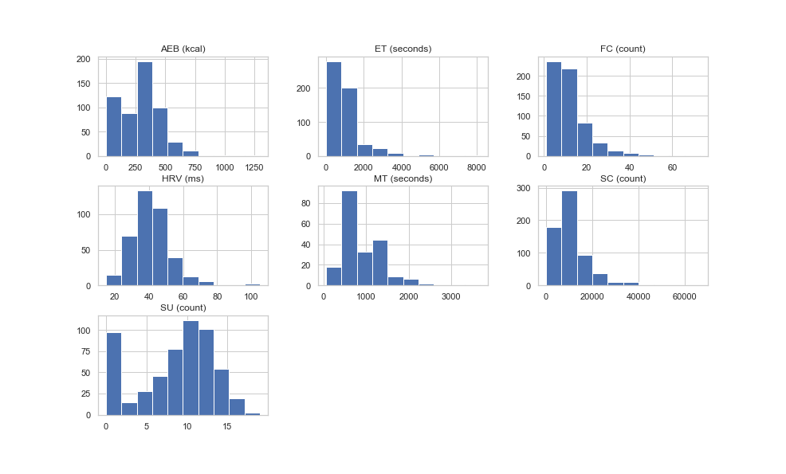
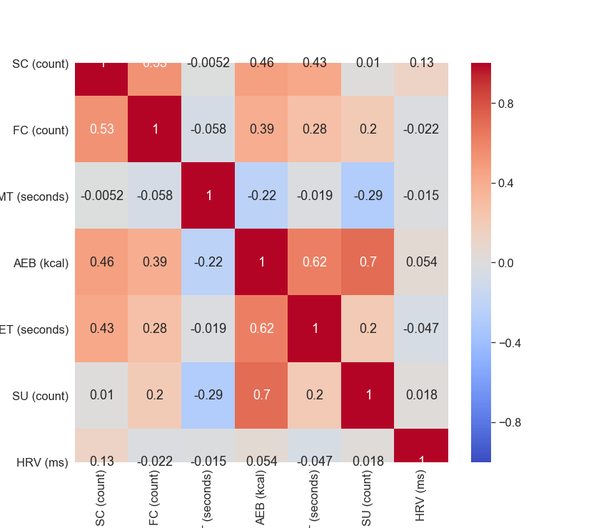
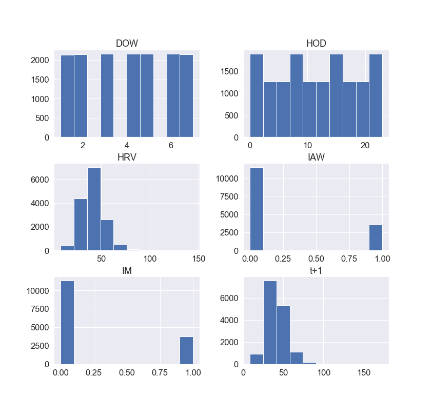
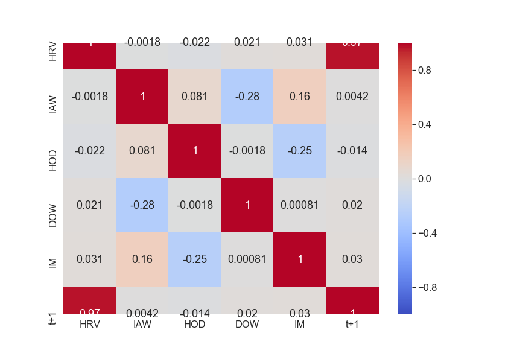

---
title: "Machine Learning Techniques applied to Heart Rate Variability"
subtitle: "Final report for the Machine Learning course of the Technical University of Denmark"
author: [Pedro Filipe Emauz Madruga]
date: "2019-12-13"
subject: "Machine Learning"
lang: "en"
bibliography: bibliography.bib
numbersections: true
...


# Introduction

Heart Rate Variability (HRV) is a way to measure the variation in time in between each heartbeat (@hrvstanford). This variation is a measure of how the heart reacts to physical exercise, mental stress and heart diseases (@1907.07496), directly linked to an increased risk of mortality (@UMETANI1998593). 

It has its origin on neurons from the parasympathetic, sympathetic nervous system and vagus nerve. Evidence suggests that HRV is impacted by stress (@Kim2018), specifically due to higher levels of stress resulting in a lower HRV (@hrv4training).

While stress (and its causes and effects) is a known research topic, it's also more accessible due to the widespread usage of wearables that allow the collection of HRV data. The combination of the possibility of stress analysis from HRV and easy access to data, makes this the main focus of the present report, determining whether machine learning techniques can help minimalizing generalization errors.

\pagebreak

# Part I

## Description of the data set

### Origin and introduction to the data sets

The data set is comprised of several different data sets, obtained from the Apple Watches of the author, over a course of around 2 years. In this time span, both the Apple Watch 3 and 4 were used and when referring to Apple Watch in this report, it pertains to both models - unless stated otherwise.

<!---
# TODO: Add addendum to describe apple watch 3 and 4
-->

The data sets are:

- Activity Energy Burned: energy in kcal burned throughout different periods of the day.
- Apple Exercise Time: number of minutes within a given interval of time where exercise was tracked. Apple considers exercise as (@applewatch):

> "_[...] every full minute of movement that equals or exceeds the intensity of a brisk walk._"

- Apple Stand Hours: number of times per hour that the subject has stood up.
- Flights Climbed: number of flights climbed within a given interval of time, measured several times during the day.
- Heart Rate: number of beats per minute measured every 5 seconds. The Apple Watch uses a technology called photoplethysmography,  where (@applewatch2)

> "_[...]green LED lights paired with light‑sensitive photodiodes to detect the amount of blood flowing._"

- Mindful Session: time span (in intervals of seconds) where a meditation session was tracked.
- Heart Rate Variability (hereafter referred to as HRV): the Apple Watch computes the standard deviation of all normal sinus RR intervals over 24h (or SDNN). An RR interval is a beat-to-beat difference. When HRV is mentioned in this report, it refers to the SDNN values.
- Activity Summary: daily summary of some of the above mentioned features.


The data was exported using the iPhone's export functionality inside the Health application. It originally it comes in a XML format and there is a number of tools available for conversion from XML to CSV format, one of which was used to do the conversion to CSV.

### Previous work with the data

Considering the lifetime of the Apple Watch, and assuming that the Heart Rate and HRV are to be included, the research is scarce and dispersed. There is research using data from Apple Watch, but falls into one of two categories: improving existing measurements (@1910.07881) or detection of various problems (as described in the introduction), some of which using Machine Learning and with success. In the latter category it was possible to verify that Machine Learning was used successfully to classify sleep-wake patterns (@1908.06856) and also detecting cardiovascular problems (@1802.02511).

However, the above mentioned cased are generic in a sense that only variations of the data set were used and for different subjects of study. In this project the data set pertains to one single user, with observations made over the course of 2 years.

Considering the target of the data is the author, nothing (besides the export) has been done to the data. The merge of the different data sets will happen as a part of the data preparation of this report.

### Primary machine learning modeling aim

<!--
Some data comes from the iPhone and this doesn't mention it.
-->

This particular data set revolves around metrics of several different attributes. The principal challenge was to select a main attribute that was both relevant in terms of health impact, while leveraging the heart rate monitoring features that the Apple Watch provides, but also with enough observations so that it can be correlated with the remainder of different attributes monitored.

As mentioned in the introduction, HRV is an indicator of one's health status quo. Specifically, a lower HRV indicates both stress and cardiovascular potential problems, according to existing research. Considering other attributes monitored by the Apple Watch, such as the steps count and/or mindful session, it provides an interesting starting point to answer how is HRV affected by certain attributes. 

Moreover, the data set with the HRV can be broken down into new interesting attributes. For instance, where is HRV higher or lower? Is it during work or after work hours? Is it during the week or the weekends? In which season of the year? Specifically, it can potentially be used for several different machine learning tasks, such as:

- Classification: how likely an HRV value belongs to a class of working hours or after-work hours. The original data doesn't have these features, thus its need to extract information from the data set. Specifically, this means that the existing HRV values (that are measured in various intervals of time), need to be split and grouped into two intervals of time (in a binary format): the first referring to an interval of time between 9am and 5pm (commonly referred as "working hours") and the period of non-working hours from 5pm to 9am. Data collected during sleeping time will be included because lower HRV (reflected as stress) can occur during the night. Nonetheless, most of measurements were made during wake time considering it was very rare that the Apple Watch was used during sleep time.

- Regression: so that it's possible to determine what's the estimated HRV value for the next day, based on the data from the previous days. The observations are made in periods more granular than a full day, but for this regression the average values of HRV will be used. There are two main reasons for this "grouping": the intervals where the observations happen are not regular and don't have the same time span. For example, there could be several measurements in the morning in one day during a period of 5minutes and in another day the period could be shorter with just a few measurements made.

- Clustering: based on HRV measurements, determine if there was more or less physical activity (namely, whether the steps count and/or the flights climbed). Another possibility is to determine any clusters regarding the time (wether being day of the week and/or hour of the day) where these measurements occurred.

- Association mining: give certain features (such as step count and/or number of meditation sessions) which are more likely to influence HRV values. Another possibility is to determine whether an HRV observation (in regards to date and time) has any probability of being measured on another date and time. An example is if there is any relation between a measurement of an HRV value in the morning with the day of the week.

Despite being a rich data set (i.e. a reasonable number of observations made over a period of 2 years, with many attributes spread over different data sets), it entails some limitations and issues. For one, there is not a single data set but rather a few different ones. It's a non-simple data set due to being a time series one. Specifically, there is one data set for the Activity Summary, one for Step Count, one for HRV, one for mindful sessions and one for flights climbed. All these data sets have different time spans and measure times thus these have had to be standardized so they can be compared - i.e., they have different intervals. These data sets were standardized through the average values per day. Nonetheless, the HRV data set could be used as a standalone non-standardized data set and some features could be created out of it.

There is also the issue regarding time span of observations, meaning that some observations were made several times during the day whereas others were not. Apple provides a summary of some of the attributes presenting observation values within a period of a day, but it's not for all attributes - namely "Active Energy Burned", "Apple Exercise Time" and "Apple Stand Hours" thus excluding HRV, flights climbed and step count.

Another issues is the definition of "Apple Exercise Time". As mentioned before, Apple describes it as anything more intense than a "brisk walk" without really defining what a brisk walk is. It's also not possible to determine which of the step count attribute counted as exercise time. The same for the flights climbed feature.

\pagebreak

## Data attributes analysis

The data attributes analysis will be split into two main data sets: the first is a standardized data set comprised of the average daily values for Active Energy Burned (AEB), Exercise Time (ET), Stand Up (SU), HRV, Step Count (SC), Flights Climbed (FC) and Meditation Time (MT); the second data set is the raw data set of the HRV, although with two added features. Each feature of each of the data sets is explained below.

There's one attribute that is transversal to both data sets: the HRV. This attribute is a continuous ratio, assuming that an HRV of 0 is an absence of measurement. A zero value refers to a really low HRV, thus indicating a level healthiness that is non-existent (in terms of the standard deviation of NN intervals, SDNN). It's measure in milliseconds (ms).

The index of both data sets is a timestamp, commonly referred to as _creationDate_ (or just _timestamp_ in other cases). In the first data set, this refers to the measurements on all of the features. Because some features were not measured at the same time, some of the values had to be dropped. This is will be scrutinized later on in this work. In the second data set this refers to when the measurements of HRV where made.

The following subchapters analyze each attribute of each data set.


### Data set I

<!--
    TODO: am I using present or past? It's not the same
-->

In order to reach to the final state of the data set I, where all the features are gathered, a few data sanitization tasks were necessary. The Activity Summary - the default exported file from the Apple Watch and iPhone - had three features: AEB, ET and SH. The format of these features were already discriminated in a a daily time interval. In other words, all measurements' values were made within an interval of a day. Let's analyse them individually:

- AEB. The unit of measure is kcal per day. It's a continuous attribute because it can take any values between the ones being measured. It has a ratio attribute type, considering there is a natural zero.

- ET. The unit of measure is in minutes per day. It's continuous and ratio.

- SU. The unit of measure is in times per day, where "time" corresponds to an integer determining how many the subject has stood up, within a total time frame of a day. It's discrete and ratio.

Following these attributes, another two sets were sanitized and merged with the above explained data. This is specifically referring to the SC, FC and MT attributes. The SC had its observations made throughout any given period of the day. In other words, whenever any step count happened, it was registered. These values are collected with the iPhone and not the Watch. In order to be merged with the above attributes they had to be "compressed" into the same time span (observations with a day span). In order to achieve this, the values of the raw data set that contained the SC were normalized by doing the sum of values per day.

A similar approach was made with the FC attribute. The raw data was normalized by doing the sum of the values of the observations per day. After these two steps (merging and normalization), the values were then merged with the remainder of the attributes of data set I. Thus, also analyzing these attributes individually:

- SC. The unit of measure is the total steps made within a day's interval. It's a discrete and ratio attribute type.

- FC. The unit of measure is the total number of flights climbed per day. It's a discrete and ratio attribute type.

- MT. The unit of measure is seconds meditated per day. It's continuous and ratio.

There are a few different issues with the data. On an initial observation, it's possible to conclude that, after the data was exported from the iPhone and Apple Watch, it had to be normalized to total values observed per day. Considering that the Activity Summary had a total number of observations (N) of 556 compared to the original N for the SC which was 38408, it's possible to understand the dimension of the reduction that happened when converting SC to units measure per day.

Another issue was regarding missing data. Not all of the features had all the observations and the missing data for these features was not occurring within the same time span than other features that also had missing data, thus reducing the total number of observations. None of the missing observations was converted to zero, meaning that the averages and other calculations for the same data set, had different N sizes.

Moreover, a few attributes at to be type-coerced, meaning that some values were strings and had to be converted to integer and floating numbers.

### Data set II 

The second data set includes an original feature (i.e., a feature that come from the original iPhone/Watch data sets) and other features that were created based on the original feature. The original feature is the HRV measurements.

Because the frequency of the measurements was irregular, a resampling of the data was necessary. Thus, an upsampling of the timestamps (specifically, the hours) was made, using mean values for the interpolation, using the following methods from the _DataFrame_ handled by _pandas_:

```
.resample('H').mean().interpolate()
```

The remaining features created were made with the goal of determining what is influenced by or influences HRV values. For this goal, the created attributes were: 

 - Is At Work (IAW). The unit of measure is binary. The value 1 is set if the time of the day is between 9am (including) and 5pm
(excluding) and 0 if the HRV observation was made during the remaining period of the day and during saturdays and sundays. It's a discrete/binary attribute with a nominal type.
- Is Above Mean Value (IAMV). The unit of measure is binary. The value 1 is set if the HRV value is above the calculated mean (which is 41.249) and a value of 0 if it's below the mean of HRV. It's a discrete/binary attribute with a nominal type. 
- Hour of Day (HOD). The unit of measure is the hour of the day (between 0 and 23). It's a discrete attribute with an interval attribute type. 
- Day of Week (DOW). The unit of measure is the day of week (between 1 and 7, where 1 represents a monday and 7 represents a sunday). It's a discrete attribute with an interval attribute type.
- Is Morning (IM). The unit of measure is binary. The value 1 is set if the date of the measurement is between 6am (included) and 12am (excluded). It's a discrete/binary attribute with a nominal type. 
- t+1. This is a lagged feature based on the HRV value. It refers to the values of the next hour. These feature was created in order to make regression possible. The unit of measure and the attribute types is the same as the HRV original values. It was made possible using the _shift_ attribute from _pandas_ library: `.shift(periods=1)`


<!-- TODO: Missing new features (check jupyter notebook for dataset II) -->


## Summary statistics of the attributes

### Data set I

Here's a preview of the values of data set I:

| Date       |   SC (count) |   FC (count) |   MT (seconds) |   AEB (kcal) |   ET (seconds) |   SU (count) |   HRV (ms) |
|:-----------|-------------:|-------------:|---------------:|-------------:|---------------:|-------------:|-----------:|
| 2018-01-16 |        10752 |            9 |            689 |      356.837 |           1200 |           13 |    36.5773 |
| 2018-01-20 |        14288 |            9 |           1382 |      337.801 |           1320 |           13 |    37.7527 |
| 2018-01-22 |         9850 |           11 |           1792 |      259.989 |            600 |           10 |    28.6433 |
| 2018-01-23 |         6884 |            4 |            705 |      337.471 |            720 |           16 |    27.9964 |
| 2018-01-27 |        34061 |           13 |           1398 |      666.704 |           5700 |            8 |    36.5746 |


Table:  First five observations (data set I)


|       |   SC (count) |   FC (count) |   MT (seconds) |   AEB (kcal) |   ET (seconds) |   SU (count) |   HRV (ms) |
|:------|-------------:|-------------:|---------------:|-------------:|---------------:|-------------:|-----------:|
| count |       111    |     111      |        111     |      111     |        111     |    111       |   111      |
| mean  |     11679.5  |      13.8829 |       1009.07  |      368.491 |       1093.51  |     11.1171  |    42.8225 |
| std   |      7862.59 |      10.3667 |        532.345 |      157.171 |        919.771 |      3.78931 |    12.3163 |
| min   |       266    |       2      |         60     |        2.684 |          0     |      1       |    21.9545 |
| 25%   |      6682.5  |       6.5    |        690     |      274.454 |        450     |      9       |    35.0982 |
| 50%   |      9850    |      12      |        811     |      356.837 |        900     |     12       |    41.7738 |
| 75%   |     14222    |      17.5    |       1351.5   |      451.418 |       1440     |     14       |    49.2031 |
| max   |     43598    |      73      |       3675     |      863.354 |       5700     |     19       |   104.893  |


Table:  Summary for daily statistics (data set I)


### Data set II

|    | timestamp           |     HRV |   IAW |   HOD |   DOW |   IM |      t+1 |
|---:|:--------------------|--------:|------:|------:|------:|-----:|---------:|
|  0 | 2018-01-16 09:00:00 | 38.7547 |     1 |     9 |     2 |    1 | nan      |
|  1 | 2018-01-16 10:00:00 | 36.4794 |     1 |    10 |     2 |    1 |  38.7547 |
|  2 | 2018-01-16 11:00:00 | 34.2041 |     1 |    11 |     2 |    1 |  36.4794 |
|  3 | 2018-01-16 12:00:00 | 31.9287 |     1 |    12 |     2 |    0 |  34.2041 |
|  4 | 2018-01-16 13:00:00 | 29.6534 |     1 |    13 |     2 |    0 |  31.9287 |

Table: First five observations (data set II)


|       |         HRV |          IAW |         HOD |         DOW |           IM |         t+1 |
|:------|------------:|-------------:|------------:|------------:|-------------:|------------:|
| count | 15069       | 15069        | 15069       | 15069       | 15069        | 15068       |
| mean  |    41.2037  |     0.23837  |    11.4992  |     4.00239 |     0.250116 |    41.2063  |
| std   |    11.9823  |     0.426101 |     6.92304 |     1.99658 |     0.433094 |    12.0014  |
| min   |     8.21203 |     0        |     0       |     1       |     0        |     8.21203 |
| 25%   |    33.5111  |     0        |     5       |     2       |     0        |    33.5131  |
| 50%   |    39.6968  |     0        |    11       |     4       |     0        |    39.6977  |
| 75%   |    47.6074  |     0        |    18       |     6       |     1        |    47.6076  |
| max   |   144.31    |     1        |    23       |     7       |     1        |   173.526   |


Table:  Summary statistics for Heart Rate Variability (data set II) with lagging (t+1)

\pagebreak

## Data visualization

## Data set I

### Detection of outliers

The detection of outliers is, for now, made through a visual analysis of the occurrences of all of the attributes. In order to visualize them in just one chart, the data was standardized (using _StandardScaler_ from _Scikit-Learn_). 
{ width=100% height=100% }

These standardized values are also excluding any non-existent values, meaning that if any of the attributes had a non-existent value, then all the attributes of that observation were also removed. This significantely reduced the number of observations to 111.

It's possible to see a few potential outlier candidates with standardized values above 4. Nonetheless, the difference between these values seem to not be too significant enough to determine them as outliers. Using visual inference to determine outliers seems to be insufficient.

### Distribution

The non-standardized histogram of the attributes is represented as: { width=100% height=100% }

The attributes don't seem to be symmetrically distributed, except for HRV which follows a bell-shaped curve (although not a perfect one). An outlier can be the explanation for the asymmetrical shape of the HRV curve. Stand Up (SU) and Step Count (SC) also seem to have outliers and an initial assumption can be that removing those outliers would turn its histograms into normally distributed curves.

\pagebreak

### Variable correlation

The correlation of the different attributes is represented as: 

{ width=100% }

It's possible to see that there are two significant correlations. One between Active Energy Burned and Exercise Time (0.62), which intuitively makes sense. And another correlation between Stand up Number and Active Energy Number (0.7). However, there seems to be a lack of correlation between any of the attributes and the HRV, thus challenging the initial premise of this project - wether the HRV is affected by other attributes.

Even though research has proven that there is a correlation between HRV and exercise time or meditation time, in this case there seems to be no correlation. A possible explanation is due to the low amount of observations (both for the standardized and non-standardized data, N=111).

\pagebreak

### Principal Components Analysis (PCA)

Being PCA a form of dimensionality reduction, it only makes sense to apply it on data sets with a relevant number of features (in this case 7 features), so that it's possible to analyze and reduce the existing dimensions. For this reason, data set I was selected for this analysis.

#### Explained variance


In order to obtain the explained variance, a PCA was performed on the entire data set I. The data set was previously scaled and the _PCA_ method from the _decomposition_ method belonging to _scikit-learn_ was then used.

```
from sklearn.decomposition import PCA

pca = PCA(n_components=7)
principal_components = pca.fit_transform(df_standardized)
```

It was now possible to obtain the _explained variance ratio_ from each of the components. The following figure represents the _cumulative explained variance_:

 { width=100% }

It's important to set an assumption before analyzing the results: in order to not loose much information from the original data set, an accumulated explained variance of above 90% is needed. 

Now analyzing the results, it's possible to verify that to keep an accumulated explained variance above the 90%, there's not much room for dimensionality reduction, since there will be the need to project the data onto (at least) 5 Principal Components. This makes the visualization of the data projected impossible, considering it's a 5-dimensional one.

However, in order to visualize it, a significant amount of information will be lost. Specifically, in order to have PC0, PC1 and PC2 visualized (which account for 71% of the cumulative explained variance), 29% of the information of the data would be lost. Moreover, in order to project the data set I onto just PC0 and PC1, 44% of the information will be lost. 

Thus there is not much room for dimensionality reduction. Nevertheless, it's possible to project the data until PC4 meaning that two dimensions can be reduced from the original data set.

\pagebreak

### Principal directions of the PCA components

For two components, the principal components directions are displayed in the following table:

|    |   Principal Component 0 |   Principal Component 1 |
|---:|------------------------:|------------------------:|
|  0 |                0.406943 |                0.481579 |
|  1 |                0.395987 |                0.30238  |
|  2 |               -0.163709 |                0.552063 |
|  3 |                0.562574 |               -0.171484 |
|  4 |                0.438216 |                0.184075 |
|  5 |                0.377186 |               -0.555503 |

Table: Principal Components Directions

It's possible to conclude, based on the table above, that relatively high values of Step Count, Flights Climbed, Active Energy Burned, Exercise Time, Stand up number will result in positive projections of the first principal component (PC0). A relatively low value of Meditation will result in a negative projection of the same PC.

For PC1, relatively high values of Step Count, Flights Climbed, Meditation and Exercise Time will result in positive projections onto this secondary component. Negative values of Stand up Number and Active Energy will result into low projections onto PC1.

#### Projected data onto the Principal Components


Considering the target is the HRV feature, figure \ref{data_projection_fig} demonstrates the projection of the target onto PC0 and PC1.

{ width=100% }

It's possible to verify that, in a two-dimensional representation, a significant amount of information for the original target has been lost, since there are higher values than the ones represented that have been omitted. 

\pagebreak

## Data set II

<!-- TODO: Specifiy nr of attributes and observations -->

Data set II is significantly different that I, due to it's inferior amount of attributes and it's number of observations. For this reason, a PCA analysis wasn't performed. Moreover, the purpose of understanding Principal Components Analysis was achieved with data set I. 

Nonetheless, a detection of outliers was made.

### Detection of outliers

The detection of outliers was made on a interpolated (i.e., lagged version of data set II).

<!-- TODO: REMOVE OUTLIER BECAUSE IT WILL BE A BEAUTIFUL NORMAL DISTRIBUTION -->
There's a potential outlier when looking at the values of HRV over time.
{ width=100% height=100% }

### Distribution

Figure \ref{ds2_hist} shows the histogram of the attributes. It seems that _HRV_ and _t+1_ follow a normal distribution. 

{ width=100% height=100% }


### Variable correlation

The heatmap on figure \ref{ds2_corr} shows the linear correlation between attributes of data set II. It's possible to see that the _t+1_ variable have a very high positive correlation (0,97). This seems to be a good indicator to use this data set for the upcoming regression exercises. 

{ width=100% }

\pagebreak

## Conclusion of Part I

The conclusion for Part I of this report can be subdivided into different categories. 

### Difference in data sets

In order to perform the needed tasks on this report, there had to be some data manipulation on the original dataset. This data manipulation was made so that _HRV_ was still a central piece of the report while still being able to fulfill the tasks at hand, wether being dimensionality reduction or just analyzing the distributions of its features.

There was a decision to split the data set into two parts (named as data set I and II). Due to it's number of features, data set I was used to perform dimensionality reduction. However, due to its reduced number of observations made it somewhat limited to perform any  Supervised (or Unsupervised) Learning tasks, as it would risk overfitting, something that will be possible to observe in the upcoming chapters.

Thus, in order to have a data set with a larger number of observations, a new data set II was created (out of the original one that contains the HRV measurements alone). It had a larger number of observations (N=932) but its observations were not equidistant in time. Thus, it was need to have data interpolation. This had a positive effect on the increase of the number of observations. However, it still had a relatively low number of features.

In the end, for both data sets, there were operations to determine correlations and outlier detection. Its conclusions are analyzed hereafter.

### PCA

A PC Analysis was made on data set I. It's possible to conclude that, in order to keep 90% of the information, it was not possible to have a higher number of dimensionality reduction. Particularly, it was possible to reduce from 7 to 5 dimensions. Therefore, in order to represent data projected onto the hyperplane that lies closest to the data (in this case 90%), it was not possible to represent it into a chart. On the other hand, to make it possible to represent the projected data onto a two-dimensional chart, a lot of the variance was lost, meaning that a lot of the information was lost.

### Correlation

On both data sets, there wasn't much linear correlation between features. Except for the _t+1_ feature which was highly correlated with HRV. There were other significant correlations between attributes but it's importance was ignore due to not being related to HRV. In a different context, these should have not been ignore but the reason was so that HRV kept being a central part of the report, by applying Machine Learning techniques related to it. 

Moreover, the correlation coefficient use only measures linear correlations as opposed to non-linear correlation. For example, it does not measure the case where "if _x_ is close to 0, then _y_ increases" (@aurelien). There are also other types of similarity measures (i.e, measuring the euclidean distance) that could have been taken and a further analysis on this topic should include those.

Another improvement to explore further correlations could be the interaction of variables, hence creating new variables. For example, what would be the effects when dividing the value of _HRV_ with _HOD_. 

### Final remarks

With the above in mind, it's possible to verify that there are some limitations for this time-series data set. Nonetheless, with the changes made to the original data and the new features created, it paves the way for the upcoming supervised learning tasks, specially when it comes to regression. These changes made it possible to continue on the track to evaluate the effects of Machine Learning techniques for a Heart Rate Variability-centric report.

### Outliers

- Potentially low number of observations
- A lot of NaN's that affects attributes (meaning that removing one row of a feature that has a NaN, will remove row for features that actually have numbers)
- Many features with different scales that needed to be standardized 
- Lack of correlation between HRV and others
- PCA analysis for DSI has a lot of information loss due to the fact that it's only possible to reduce two dimensions out of 7 total
- It's a time series so a non-<> type of data
- Dataset II will be used - because it has more observations and better correlation (does it?)


\pagebreak

# Part II - Supervised Learning

## Regression - part A

### 1.

- Which variable is going to be predicted?
 HRV
- Based on?
It's a time series, so date. "Above Mean Average" is the selected feature since it correlates well.
- Why?
To determine how HRV progress over time (and wether above average or being morning/afternoon influences higher values for HRV)
- Feature transformations
One-hot-encoding was not used because the features were non-categorical
All features were standardized (using StandardScaler) (show df_hrv_scaled.head())
Converted to polinomial regression after noticing that the RMSE values were lower (2 degrees) when doing a learning regression for polinomial and linear   

### 2.

- Split test and train (0.20) (hold-one-out)
- Did a normal linear regression (show RMSE value)
- Explain the alphas interval (show the code)
- Ridge was used
    - Explain why (because of the weights)
    - Show chart "ridge coefficients"
    - Optimal alpha value (one with not a lot of bias and not a lot of variance) was close to XX (XX = alpha from RidgeCV)
    - Determined RidgeCV (alphas = alphas, cv=10)
    - Show actual versus predicted
- "So, if the alpha value is 0, it means that it is just an Ordinary Least Squares Regression model. The L2 norm term in ridge regression is weighted by the regularization parameter alpha. So, if the alpha value is 0, it means that it is just an Ordinary Least Squares Regression model. So, the larger is the alpha, the higher is the smoothness constraint. So, the smaller the value of alpha, the higher would be the magnitude of the coefficients."

### 3.

- RidgeCV was used but the data set was split before into train and test set. So the ridgeCV, which had a K=10, was fitted to train_set. The predictions from the model were made using the original test_set , isolated from the ones created within RidgeCV, using a hold-one-out method.
- The coefficient of the model was 0.76. This means that for every unit of the Is Above Mean, there are 0.76 units of HRV increasing. Because there is only one feature - due to the low correlation of the other ones -, it's no possible to compare with other coefficients (presumably, they would have low coefficient, thus a low effect on the HRV value). This is for the scaled dataset.
- It does make sense, because it shows that HRV increases with above mean values. In practical terms, if an above mean value represents a "healthy" day, then a higher value has an effect on a higher value of HRV


### Conclusions part A

- This dataset is limited for a linear regression.
- Because the feature with highest correlation is binary
- Other features are not highly correlated
- A better to have continuous values and analyze would be to use the time series for forecast. To do that, the timestamp should be transformed in order to have a lag.
- Non-regularized has better scores than regularized

\pagebreak

## Classification

### Baseline model (log regression)

- Resampled data with interpolation
- 


\pagebreak

# Unsupervised learning

## Hierarquical clustering

- Agglomerative hierarquical clustering 
- affinity -> euclidean. explain why.
- linkage -> ward. explain why.
- Created dendogram to find ideal number of clusters. Explain how nr of clusters was found and show dendogram picture.

## Gaussian Mixture Model

## Anomaly/outlier detection

- (Inspiration from https://machinelearningmastery.com/probability-density-estimation/)
- pag 236 do handson
- Nao ha anomalies ou outliers

- 

# References
