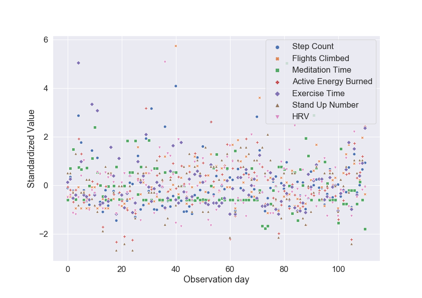
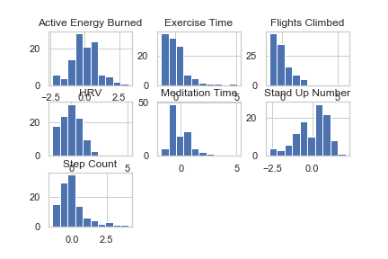
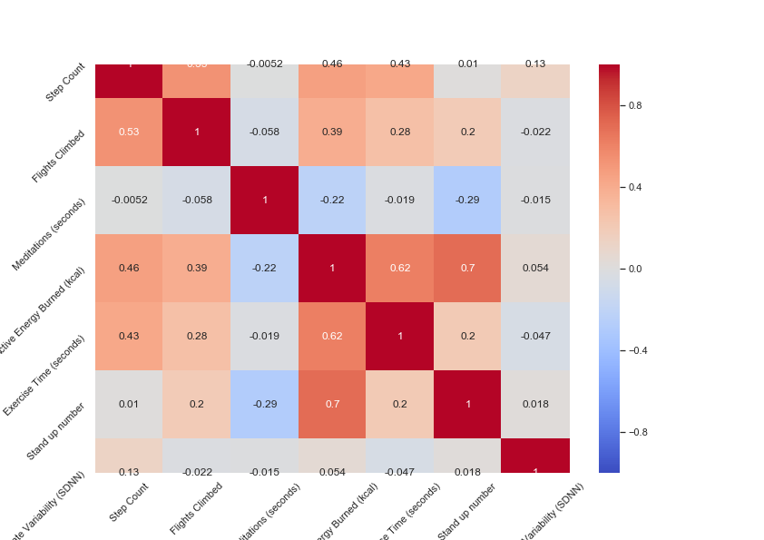
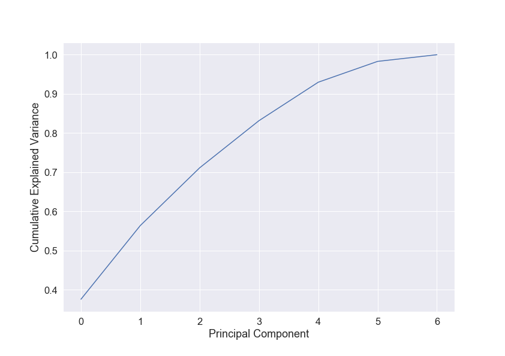
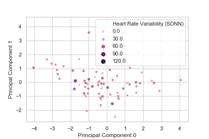
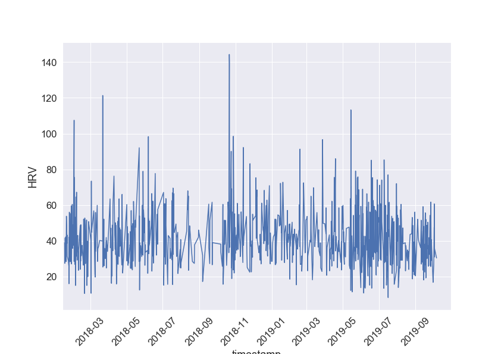

---
title: "Machine Learning Techniques applied to Heart Rate Variability"
subtitle: "Final report for the Machine Learning course of the Technical University of Denmark"
author: [Pedro Filipe Emauz Madruga]
date: "2019-12-13"
subject: "Machine Learning"
lang: "en"
bibliography: bibliography.bib
numbersections: true
...

# Introduction

Heart Rate Variability (HRV) is a way to measure the variation in time in between each heartbeat (@hrvstanford). This variation is a measure of how the heart reacts to physical exercise, mental stress and heart diseases (@1907.07496), directly linked to an increased risk of mortality (@UMETANI1998593). 

It has its origin on neurons from the parasympathetic, sympathetic nervous system and vagus nerve. Evidence suggests that HRV is impacted by stress (@Kim2018), specifically due to higher levels of stress resulting in a lower HRV (@hrv4training).

While stress (and its causes and effects) is a known research topic, it's also more accessible due to the widespread usage of wearables that allow the collection of HRV data. The combination of the possibility of stress analysis from HRV and easy access to data, makes this the main focus of the present report, determining whether machine learning techniques can help minimalizing generalization errors.

\pagebreak

# Part I

## Description of the data set

### Origin and introduction to the data sets

The data set is comprised of several different data sets, obtained from the Apple Watches of the author, over a course of around 2 years. In this time span, both the Apple Watch 3 and 4 were used and when referring to Apple Watch in this report, it pertains to both models - unless stated otherwise.

<!---
# TODO: Add addendum to describe apple watch 3 and 4
-->

The data sets are:

- Activity Energy Burned: energy in kcal burned throughout different periods of the day.
- Apple Exercise Time: number of minutes within a given interval of time where exercise was tracked. Apple considers exercise as (@applewatch):

> "_[...] every full minute of movement that equals or exceeds the intensity of a brisk walk._"

- Apple Stand Hours: number of times per hour that the subject has stood up.
- Flights Climbed: number of flights climbed within a given interval of time, measured several times during the day.
- Heart Rate: number of beats per minute measured every 5 seconds. The Apple Watch uses a technology called photoplethysmography,  where (@applewatch2)

> "_[...]green LED lights paired with light‑sensitive photodiodes to detect the amount of blood flowing._"

- Mindful Session: time span (in intervals of seconds) where a meditation session was tracked.
- Heart Rate Variability (HRV): the Apple Watch computes the standard deviation of all normal sinus RR intervals over 24h (or SDNN). An RR interval is a beat-to-beat difference. When HRV is mentioned in this report, it refers to the SDNN values.
- Activity Summary: daily summary of some of the above mentioned features.

The data was exported using the iPhone's export functionality inside the Health application. It originally it comes in a XML format and there is a number of tools available for conversion from XML to CSV format, one of which was used to do the conversion to CSV.

### Previous work with the data

Considering the lifetime of the Apple Watch, and assuming that the Heart Rate and HRV are to be included, the research is scarce and dispersed. There is research using data from Apple Watch, but falls into one of two categories: improving existing measurements (@1910.07881) or detection of various problems (as described in the introduction), some of which using Machine Learning and with success. In the latter category it was possible to verify that Machine Learning was used successfully to classify sleep-wake patterns (@1908.06856) and also detecting cardiovascular problems (@1802.02511).

However, the above mentioned cased are generic in a sense that only variations of the data set were used and for different subjects of study. In this project the data set pertains to one single user, with observations made over the course of 2 years.

Considering the target of the data is the author, nothing (besides the export) has been done to the data. The merge of the different data sets will happen as a part of the data preparation of this report.

### Primary machine learning modeling aim

<!--
Some data comes from the iPhone and this doesn't mention it.
-->

This particular data set revolves around metrics of several different attributes. The principal challenge was to select a main attribute that was both relevant in terms of health impact, while leveraging the heart rate monitoring features that the Apple Watch provides, but also with enough observations so that it can be correlated with the remainder of different attributes monitored.

As mentioned in the introduction, HRV is an indicator of one's health status quo. Specifically, a lower HRV indicates both stress and cardiovascular potential problems, according to existing research. Considering other attributes monitored by the Apple Watch, such as the steps count and/or mindful session, it provides an interesting starting point to answer how is HRV affected by certain attributes. 

Moreover, the data set with the HRV can be broken down into new interesting attributes. For instance, where is HRV higher or lower? Is it during work or after work hours? Is it during the week or the weekends? In which season of the year? Specifically, it can potentially be used for several different machine learning tasks, such as:

- Classification: how likely an HRV value belongs to a class of working hours or after-work hours. The original data doesn't have these features, thus its need to extract information from the data set. Specifically, this means that the existing HRV values (that are measured in various intervals of time), need to be split and grouped into two intervals of time (in a binary format): the first referring to an interval of time between 9am and 5pm (commonly referred as "working hours") and the period of non-working hours from 5pm to 9am. Data collected during sleeping time will be included because lower HRV (reflected as stress) can occur during the night. Nonetheless, most of measurements were made during wake time considering it was very rare that the Apple Watch was used during sleep time.

- Regression: so that it's possible to determine what's the estimated HRV value for the next day, based on the data from the previous days. The observations are made in periods more granular than a full day, but for this regression the average values of HRV will be used. There are two main reasons for this "grouping": the intervals where the observations happen are not regular and don't have the same time span. For example, there could be several measurements in the morning in one day during a period of 5minutes and in another day the period could be shorter with just a few measurements made.

- Clustering: based on HRV measurements, determine if there was more or less physical activity (namely, whether the steps count and/or the flights climbed).

- Association mining: give certain features (such as step count and/or number of meditation sessions) which are more likely to influence HRV values.

Despite being a rich data set (i.e. a reasonable number of observations made over a period of 2 years, with many attributes spread over different data sets), it entails some limitations and issues. For one, there is not a single data set but rather a few, thus it's a non-simple data set due to its temporal structure. Specifically, there is one data set for the Activity Summary, one for Step Count, one for HRV, one for mindful sessions and one for flights climbed. All these data sets have different time spans and measure times thus these have had to be standardized so they can be compared - i.e., they have different intervals. These data sets were standardized through the average values per day. Nonetheless, the HRV data set could be used as a standalone non-standardized data set and some features could be created out of it.

There is also the issue regarding time span of observations, meaning that some observations were made several times during the day whereas others were not. Apple provides a summary of some of the attributes presenting observation values within a period of a day, but it's not for all attributes - namely "Active Energy Burned", "Apple Exercise Time" and "Apple Stand Hours" thus excluding HRV, flights climbed and step count.

Another issues is the definition of "Apple Exercise Time". As mentioned before, Apple describes it as anything more intense than a "brisk walk" without really defining what a brisk walk is. It's also not possible to determine which of the step count attribute counted as exercise time. The same for the flights climbed feature.

\pagebreak

## Data attributes analysis

The data attributes analysis will be split into two main data sets: the first is a standardized data set comprised of the average daily values for Active Energy Burned (AEB), Exercise Time (ET), Stand Hours (SH), HRV, Step Count (SC), Flights Climbed (FC) and Meditation Time (MT); the second data set is the raw data set of the HRV (measured as SDNN), although with two added features. Each feature of each of the data sets is explained below.

### Data set I

<!--
    TODO: am I using present or past? It's not the same
-->

In order to reach to the final state of the data set I, where all the features are gathered, a few data sanitization tasks were necessary. The Activity Summary - the default exported file from the Apple Watch and iPhone - had three features: AEB, ET and SH. The format of these features were already discriminated in a a daily time interval. In other words, all measurements' values were made within an interval of a day. Let's analyse them individually:
    * AEB. The unit of measure is kcal per day. It's a continuous attribute because it can take any values between the ones being measured. It has a ratio attribute type, considering there is a natural zero.
    * ET. The unit of measure is in minutes per day. It's continuous and ratio.
    * SH. The unit of measure is in times per day, where "time" corresponds to an integer determining how many the subject has stood up, within a total time frame of a day. It's discrete and ratio.

Following these attributes, another two sets were sanitized and merged with the above explained data. This is specifically referring to the SC, FC and MT attributes. The SC had its observations made throughout any given period of the day. In other words, whenever any step count happened, it was registered. These values are collected with the iPhone and not the Watch. In order to be merged with the above attributes they had to be "compressed" into the same time span (observations with a day span). In order to achieve this, the values of the raw data set that contained the SC were normalized by doing the sum of values per day.

A similar approach was made with the FC attribute. The raw data was normalized by doing the sum of the values of the observations per day. After these two steps (merging and normalization), the values were then merged with the remainder of the attributes of data set I. Thus, also analyzing these attributes individually:
    * SC. The unit of measure is the total steps made within a day's interval. It's a discrete and ratio attribute type.
    * FC. The unit of measure is the total number of flights climbed per day. It's a discrete and ratio attribute type.
    * MT. The unit of measure is minutes meditated per day. It's continuous and ratio.

There are a few different issues with the data. On an initial observation, it's possible to conclude that, after the data was exported from the iPhone and Apple Watch, it had to be normalized to total values observed per day. Considering that the Activity Summary had a total number of observations (N) of 556 compared to the original N for the SC which was 38408, it's possible to understand the dimension of the reduction that happened when converting SC to units measure per day.

Another issue was regarding missing data. Not all of the features had all the observations and the missing data for these features was not occurring within the same time span than other features that also had missing data, thus reducing the total number of observations. None of the missing observations was converted to zero, meaning that the averages and other calculations for the same data set, had different N sizes.

Moreover, a few attributes at to be type-coerced, meaning that some values were strings and had to be converted to integer and floating numbers.

### Data set II 

The second data set includes an original feature and other features that were created based on the original feature. The original feature is the HRV measurements. This attribute is a continuous ratio, assuming that an HRV of 0 is an absence of measurement. A zero value refers to a really low HRV, thus indicating a level healthiness that is not existent (in terms of the standard deviation of NN intervals, SDNN).

The remaining features created were made with the goal of determining what is influenced by or influences HRV values. For this goal, the created attributes were: 

 * Is At Work (IAW). The unit of measure is binary. The value 1 is set if the time of the day is between 9am (including) and 5pm
(excluding) and 0 if the HRV observation was made during the remaining period of the day and during saturdays and sundays. It's a discrete/binary attribute with a nominal type.
* Is Above Mean Value (IAMV). The unit of measure is binary. The value 1 is set if the HRV value is above the calculated mean (which is 41.249) and a value of 0 if it's below the mean of HRV. It's a discrete/binary attribute with a nominal type. 
* Hour of Day (HOD). The unit of measure is the hour of the day (between 0 and 23). It's a discrete attribute with an interval attribute type. 

## Summary statistics of the attributes

### Data set I

<!-- TODO: Show head  -->

|       |   Step Count |   Flights Climbed |   Meditations (seconds) |   Active Energy Burned (kcal) |   Exercise Time (seconds) |   Stand up number |   Heart Rate Variability (SDNN) |
|:------|-------------:|------------------:|------------------------:|------------------------------:|--------------------------:|------------------:|--------------------------------:|
| count |       626    |         600       |                 205     |                       553     |                   553     |         553       |                        387      |
| mean  |     10753.3  |          11.9117  |                 940.785 |                       288.415 |                   952.948 |           8.53526 |                         41.0839 |
| std   |      7756.12 |           8.77128 |                 482.322 |                       188.435 |                   935.696 |           4.9085  |                         11.2355 |
| min   |         8    |           1       |                  60     |                         0     |                     0     |           0       |                         15.0717 |
| 25%   |      6340.25 |           6       |                 690     |                       189.792 |                   300     |           5       |                         33.6575 |
| 50%   |      9219    |          10       |                 718     |                       305.587 |                   780     |          10       |                         40.2702 |
| 75%   |     13273.5  |          15       |                1291     |                       397.281 |                  1320     |          12       |                         47.0749 |
| max   |     66675    |          73       |                3675     |                      1297.69  |                  8160     |          19       |                        104.893  |

Table:  Summary for daily statistics (data set I)

### Data set II

<!-- TODO: Show .head() -->

|       |   HRV (SDNN) |   Is at Work (binary) |   Is Above Mean Value |   Hour of Day |
|:------|-------------:|----------------------:|----------------------:|--------------:|
| count |    932       |            932        |            932        |     932       |
| mean  |     41.2493  |              0.43133  |              0.433476 |      14       |
| std   |     15.6852  |              0.495528 |              0.495821 |       5.30893 |
| min   |      8.21203 |              0        |              0        |       0       |
| 25%   |     30.8391  |              0        |              0        |      10       |
| 50%   |     38.8085  |              0        |              0        |      14       |
| 75%   |     49.5485  |              1        |              1        |      18       |
| max   |    173.526   |              1        |              1        |      23       |

Table:  Summary statistics for Heart Rate Variability (data set II)

\pagebreak

## Data visualization

## Data set I

### Detection of outliers

The detection of outliers is, for now, made through a visual analysis of the occurences of all of the attributes. In order to visualize them in just one chart, the data was standardized (using _StandardScaler_ from _Scikit-Learn_). 
{ width=100% height=100% }

These standardized values are also excluding any non-existent values, meaning that if any of the attributes had a non-existent value, then all the attributes of that observation were also removed. This significantely reduced the number of observations to 110.

It's possible to see a few potential outlier candidates with values above 4. Nonetheless, the difference between these values seem to not be too significant enough to determine them as outliers. Using visual inference to determine outliers is probably insufficient and incorrect.

### Distribution

The non-standardized histogram of the attributes is represented as: { width=100% height=100% }

The attributes don't seem to be symmetrically distributed, except for HRV which follows a bell-shaped curve (although not a perfect one). An outlier can be the explanation for the asymmetrical shape of the HRV curve.

\pagebreak

### Variable correlation

The correlation of the different attributes is represented as: 

{ width=100% }

It's possible to see that there are two significant correlations. One between Active Energy Burned and Exercise Time (0.62), which intuitively makes sense. And another correlation between Stand up Number and Active Energy Number (0.72). However, there seems to be a lack of correlation between any of the attributes and the HRV, thus challenging the initial premise of this project - wether the HRV is affected by other attributes.

Even though research has proven that there is a correlation between HRV and exercise time or meditation time, in this case there seems to be no correlation. A possible explanation is due to the low amount of observations (both for the standardized and non-standardized data).

\pagebreak

### Principal Components Analysis

#### Explained variance

In order to obtain the explained variance, a PCA was performed on the entire data set I. The result is shown as the following: { width=100% }

It's important to set an assumption before analyzing the results: in order to not loose much information from the original data set, an accumulated explained variance of above 90% is needed. Now analyzing the results, it's possible to verify that to keep an accumulated explained variance above the 90%, there's not much room for dimensionality reduction, since there will be the need to project the data onto 5 Principal Components. This makes the visualization of the data projected impossible, considering it's a 5-dimensional one.

In order to visualize it, a significant amount of information will be lost. Specifically, in order to have PC0, PC1 and PC2 visualized (which account for 71% of the cumulative explained variance), 29% of the information of the data would be lost. Moreover, in order to project the data set I onto just PC0 and PC1, 44% of the information will be lost. 

Thus there is not much room for dimensionality reduction. Nevertheless, it's possible to project the data until PC4 meaning that two dimensions can be reduced from the original data set.

\pagebreak

### Principal directions of the PCA components

For two components, the principal components directions are displayed in the following table:

|    |   Principal Component 0 |   Principal Component 1 |
|---:|------------------------:|------------------------:|
|  0 |                0.406943 |                0.481579 |
|  1 |                0.395987 |                0.30238  |
|  2 |               -0.163709 |                0.552063 |
|  3 |                0.562574 |               -0.171484 |
|  4 |                0.438216 |                0.184075 |
|  5 |                0.377186 |               -0.555503 |

Table: Principal Components Directions

It's possible to conclude, based on the table above, that relatively high values of Step Count, Flights Climbed, Active Energy Burned, Exercise Time, Stand up number will result in positive projections of the first principal component (PC0). A relatively low value of Meditation will result in a negative projection of the same PC.

For PC1, relatively high values of Step Count, Flights Climbed, Meditation and Exercise Time will result in positive projections onto this secondary component. Negative values of Stand up Number and Active Energy will result into low projections onto PC1.

#### Projected data onto the Principal Components

Considering the target is the HRV feature, the following figure demonstrates the projection of the target onto PC0 and PC1:

{ width=100% }

It's possible to verify that, in a two-dimensional representation, that a significant amount of information for the original target has been lost, since there are higher values than the ones represented that have been omitted. 

\pagebreak

## Data set II

<!-- TODO: Specifiy nr of attributes and observations -->

Data set II is significantly different that I, due to it's inferior amount of attributes and it's number of observations.

### Detection of outliers

There's a potential outlier when looking at the values of HRV over time.
{ width=100% height=100% }

\pagebreak

## Conclusion of Part I

- Potentially low number of observations
- A lot of NaN's that affects attributes (meaning that removing one row of a feature that has a NaN, will remove row for features that actually have numbers)
- Many features with different scales that needed to be standardized 
- Lack of correlation between HRV and others
- PCA analysis for DSI has a lot of information loss due to the fact that it's only possible to reduce two dimensions out of 7 total
- It's a time series so a non-<> type of data
- Dataset II will be used - because it has more observations and better correlation (does it?)

\pagebreak

# References
